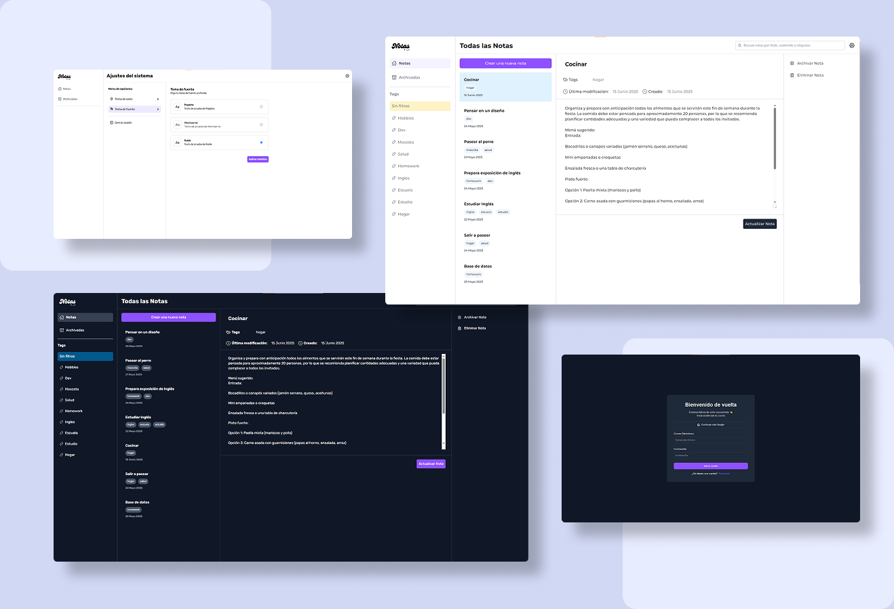
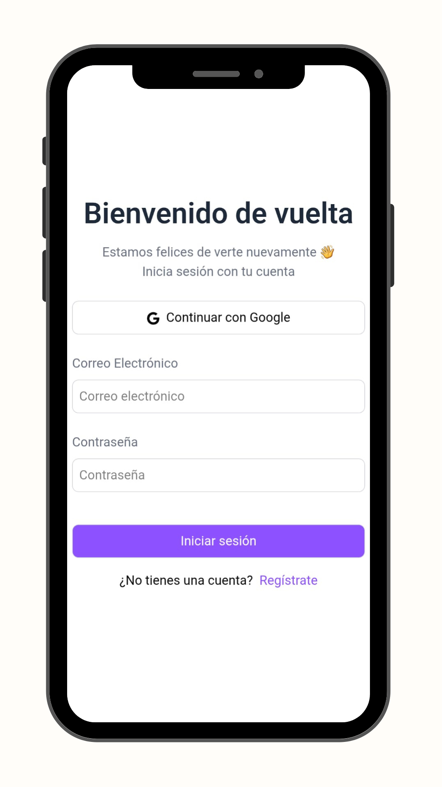
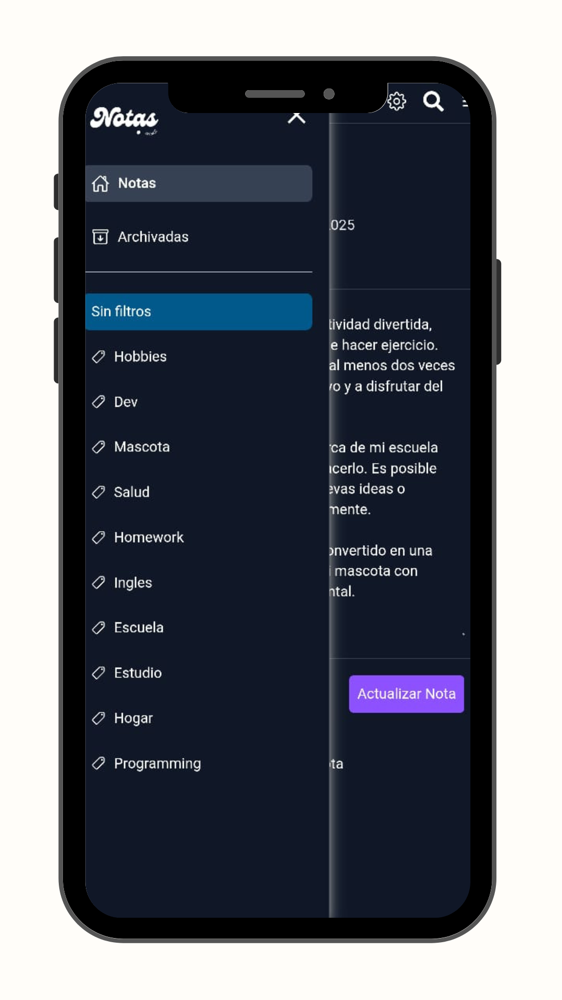
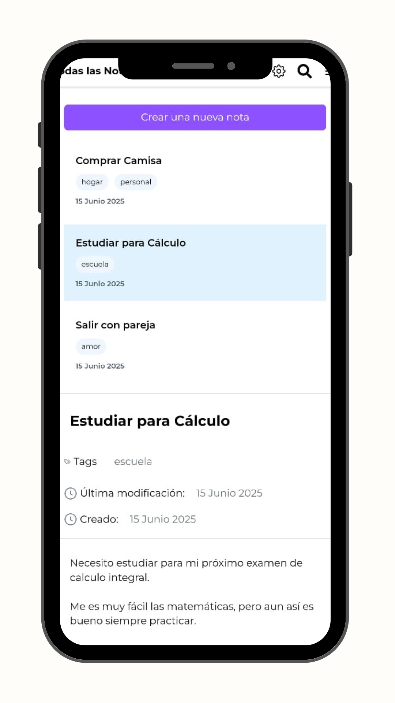
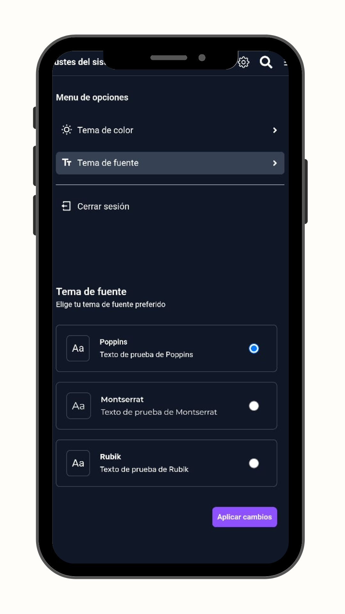
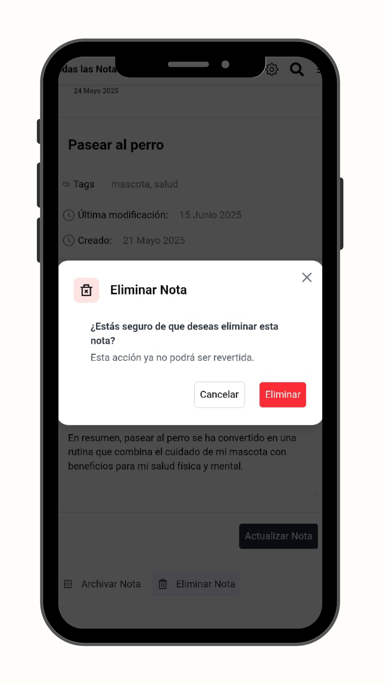

# 📝 Notes App – A Modern Note-Taking Web Application

A clean, organized, and responsive note-taking app built with modern web technologies like **React**, **TypeScript**, **TailwindCSS**, **Redux**, and **Firebase**.



## 🚀 Features

- ✍️ Create, edit, and delete notes
- 🗂️ Organize notes using folders and tags
- 🌗 Light and dark theme support
- 🔐 Secure authentication with Firebase
- 💾 Persistent note storage using Firestore (non real-time)
- 🔎 Search and filter notes by tags
- 📱 Fully responsive and user-friendly design

## 🛠️ Tech Stack

- **React** – UI library for building components
- **TypeScript** – Strongly typed JavaScript
- **TailwindCSS** – Utility-first CSS framework
- **Redux Toolkit** – Global state management
- **Firebase** – Authentication and Firestore database
- **HTML5** – Structural foundation

## 📦 Getting Started

1. Clone the repo:
```
  git clone https://github.com/your-username/notes-app.git
  cd notes-app
```

2. Install Dependencies
```
  npm install
```

3. Create a .env file in the root directory and add your Firebase credentials:
```
  VITE_API_KEY=your_api_key
  VITE_AUTH_DOMAIN=your_auth_domain
  VITE_PROJECT_ID=your_project_id
  VITE_STORAGE_BUCKET=your_storage_bucket
  VITE_MESSAGING_SENDER_ID=your_messaging_sender_id
  VITE_APP_ID=your_app_id
```

4. Start the development server:
```
  npm run dev
```

## 📤 Deployment
This project can be easily deployed to Netlify, Vercel, or any static hosting provider. Make sure to add all required environment variables in your hosting dashboard.

## 📸 Screenshots

<div style="display: flex; flex-wrap: wrap; gap: 10px;">
  
  
  
  
  
</div>
